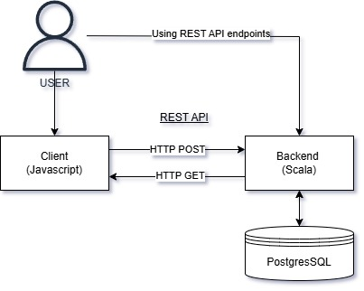
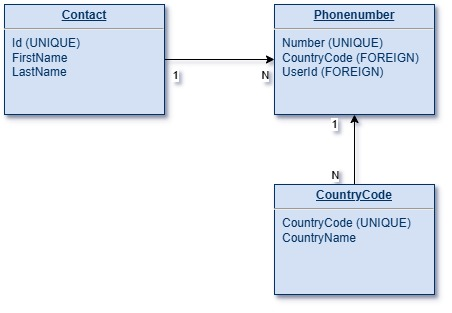

# Puhelinluettelo Project

## Overview

The Puhelinluettelo project is a full-stack application designed to manage a phone directory. It consists of a backend built with the Play Framework, a frontend built with React, and a PostgreSQL database for data storage. The system allows users to add, view, update, and delete phone directory entries through a user-friendly web interface.



## System Components

### Backend

The backend of the Puhelinluettelo project is developed using the Play Framework, a high-productivity web application framework written in Scala. It handles all the business logic, data processing, and API endpoints for the application.

- **Framework**: Play Framework (Scala)
- **Dependencies**: Slick for database access, Guice for dependency injection
- **Port**: The backend service runs on port 9000.

### Frontend

The frontend is built using React, a popular JavaScript library for building user interfaces. It provides a dynamic and responsive user experience, allowing users to interact with the phone directory seamlessly.

- **Framework**: React
- **Dependencies**: Axios for API calls, React Router for navigation
- **Port**: The frontend service runs on port 80.

### Database

The database is powered by PostgreSQL, a powerful, open-source object-relational database system. It stores all the phone directory entries and user data.

- **Database**: PostgreSQL
- **Port**: The database service runs on port 5432 internally and is mapped to port 5433 on the host machine for external access.
- **Schema**: The database schema is designed to efficiently store and retrieve phone directory entries.



## Getting Started

### Prerequisites

- Docker and Docker Compose installed on your machine.

### Installation

1. **Clone the Repository**:
   ```sh
   git clone https://github.com/yourusername/puhelinluettelo.git
   cd puhelinluettelo 
2. **Build and Run the Application:**
```sh
docker-compose up --build
```
3 **Access the Application:**
- Frontend: http://localhost
- Backend: http://localhost:9000
- Database: Connect to localhost:5433 using a PostgreSQL client.

### Project Structure

- /puhelinluettelo-backend: Contains the backend code and Dockerfile.
- /puhelinluettelo-frontend: Contains the frontend code and Dockerfile.
- /database: Contains the database initialization scripts and Dockerfile.
- docker-compose.yml: Defines the services and their configurations.

### Contributing
Contributions are welcome! Please open an issue or submit a pull request.

### License
This project is licensed under the MIT License.
